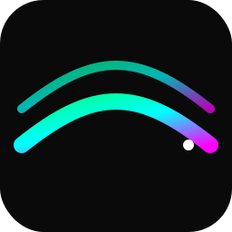

  
  
  # WAVEFRAME
  ### *Digital Engineering & Avant-Garde Design*

  
  
  
  
  

  ---

  **WaveFrame** es una plataforma de vanguardia diseñada para redefinir la presencia digital a través de la fusión perfecta entre ingeniería de alto impacto y estética visual inmersiva.

  [Explorar Demo](#) • [Ver Manifiesto](#) • [Contacto](#)

 

## 🚀 La Visión
WaveFrame no es solo una landing page; es una declaración de intenciones. Hemos construido una experiencia que desafía los límites de la web convencional, utilizando tecnologías de última generación para crear una interfaz que se siente viva, reactiva y futurista.

### 💎 Pilares del Proyecto
- **Ingeniería de Élite**: Arquitectura robusta basada en React 19 y TypeScript para un rendimiento impecable.
- **Diseño Disruptivo**: Una interfaz HUD (Heads-Up Display) que sumerge al usuario en un entorno de alta tecnología.
- **Experiencia Inmersiva**: Integración nativa de Three.js para renderizado 3D y GSAP para coreografías de movimiento fluidas.

 

## 🛠️ Stack Tecnológico
El ecosistema de WaveFrame está compuesto por las herramientas más potentes del desarrollo moderno:

- **Core:** React 19 (Experimental) & Vite
- **3D & Gráficos:** Three.js, React Three Fiber & Post-processing
- **Animaciones:** GSAP (GreenSock) & Tailwind Animate
- **Estilos:** Tailwind CSS v4.0 (Modern Engine)
- **Componentes UI:** Shadcn/UI, Radix UI & Magic UI
- **Data Viz:** Recharts (Gráficos interactivos)
- **Utilidades:** Zod, React Hook Form, Sonner & Lucide React
- **Experiencia:** Lenis (Smooth Scroll) & Framer Motion Flow

 

## ✨ Características Principales
- **Sistema HUD Dinámico**: Interfaz reactiva con telemetría simulada en tiempo real y efectos de glitch visual.
- **Renderizado 3D Inmersivo**: Escenas interactivas optimizadas para WebGL con soporte para post-procesado avanzado.
- **Navegación de Nueva Generación**: Sistema de scroll suave (Lenis) y transiciones coreografiadas con GSAP.
- **Arquitectura de Datos**: Formularios tipados con Zod y visualizaciones de datos elegantes mediante Recharts.
- **Diseño Adaptativo & Dark Mode**: Experiencia optimizada para múltiples dispositivos con gestión de temas inteligente.

 

## 📸 Galería Visual
*A continuación se muestran capturas de la experiencia inmersiva de WaveFrame:*

  
  
<i>Interfaz HUD y Escena 3D Interactiva</i>

  
   

  

    
    
  

 

---

  
Diseñado con pasión por la innovación tecnológica.

  
<b>WaveFrame // 2026</b>

